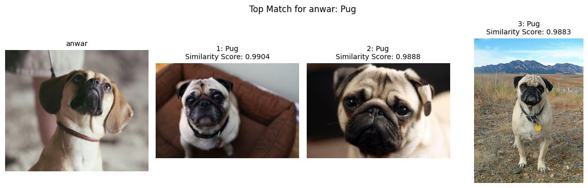
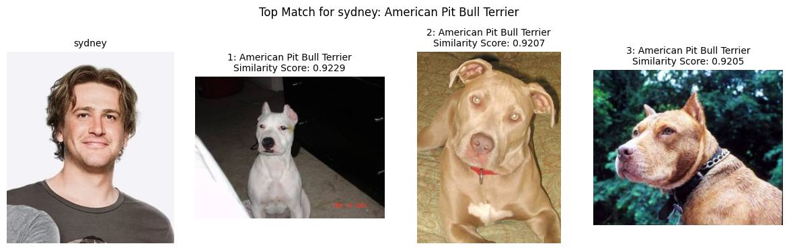
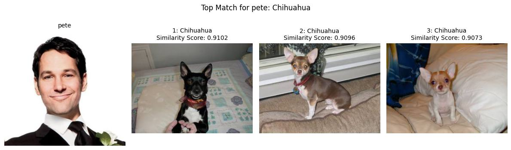

# Bowser
A Convolution Neural Network (CNN) that classifies dog breeds.

- [Motivation](#Motivation)
- [Goal](#Goal)
- [Success Metrics](#Success-Metrics)
- [Results](#Results)
- [Next Steps and Ideas](#Next-Steps-and-Ideas)
  - [API Integration](#API-Integration)
  - [Generative Adversarial Network (GAN)](#Generative-Adversarial-Network-(GAN))
  - [GPU Optimization](#GPU-Optimization)
- [Code Structure](#Code-Structure)
- [Citations](#Citations)

## Motivation
This project was semi-inspired by the film *I Love You, Man*. Directed by John Hamburg, DreamWorks Pictures, 2009. <br/>
In the movie, the character Sydney refers to "people who look just like their dog" as "bowsers". See the clip [here](https://youtu.be/p9npLFB4lk8?si=3SWXpMINBimLIIWH&t=40).<br/>

The otherside of my motivation stems from general interest in Generative AI and Machine Learning.<br/>
I wanted to explore a totally new side of deep learning. Computer Vision is facisnating and the potential capabilities of its application are endless. That being said, this project isn't intended to be highly innovative. 

## Goal
*Overall*: Build a model which classifies the dog breed of new images.<br/>
*Focused*: Predict the "bowser" breed for a few of the main characters in the movie: *I Love You, Man*.

I'm specifically targeting Dog Breeds from the Oxford-IIIT Pet Dataset. The dataset contains 25 dog breeds (no mixed breeds), limited to the following:
<details>
<summary> Expand List of Dog Breeds</summary>

- 'American Bulldog'
- 'American Pit Bull Terrier'
- 'Basset Hound'
- 'Beagle'
- 'Boxer'
- 'Chihuahua'
- 'English Cocker Spaniel'
- 'English Setter'
- 'German Shorthaired'
- 'Great Pyrenees'
- 'Havanese'
- 'Japanese Chin'
- 'Keeshond'
- 'Leonberger'
- 'Miniature Pinscher'
- 'Newfoundland'
- 'Pomeranian'
- 'Pug'
- 'Saint Bernard'
- 'Samoyed'
- 'Scottish Terrier'
- 'Shiba Inu'
- 'Staffordshire Bull Terrier'
- 'Wheaten Terrier'
- 'Yorkshire Terrier'
</details>
<br/>

To view samples of these breeds, please navigate to: `notebooks/view_training_data.ipynb`

To view more information about model selection and performance, please visit: `notebooks/view_performance.ipynb`

## Success Metrics
Outside of general model performance, what *is* the best way to measure whether the character's predicted breed is accurate? 

The definition of a "bowser" in this case is subjective. There isn't necessarily a right answer when predicting a dog breed for a human.

As a benchmark I'll use Anwar, the dog which belongs to Sydney's character in the movie. Anwar isn't a pure bred dog; Sydney refers to Anwar as a "puggle". A puggle is a mix between a Pug and a Beagle. If I predict Anwar's top breed to be a Pug, I'll have confidence in the model.

### Cosine Similarity

I'm using Cosine Similarity to measure the "similarity" between the target image tensors and the dog breed image tensors. This is relatively standard for image classification, however there are other metrics which can be used such as Cosine Distance and Euclidean Distance.

The formula for Cosine Similarity is given by:

 \( A · B \) / \( ||A|| x ||B|| \)

where:
- \( A \) and \( B \) are two vectors,
- \( A · B \) is the dot product of the vectors,
- ||A|| and ||B|| are the magnitudes (norms) of the vectors.

The top breeds are then ranked by cosine similarity, which is denoted as "Similarity Score". Scores can range from -1 to 1. Scores equalling 1 indicates maximum similarity. 

## Results
Below are the main results from my final model. The target images draw signficant similarities between multiple images, meaning there isn't 1 image that stands out in comparison to the rest. Note that the top "breeds" for each target align with each other. This gives me confidence in the model!

### Anwar:
Success! Anwar matches to a Pug over 99% of the time! <br/>




### Sydney:




### Pete:


To view more information about these predictions, please visit: `notebooks/predict.ipynb`


## Next Steps and Ideas
In the future, I would like to explore the following:

### API Integration
When I tell family and friends what I've been working on for fun... they always say "you have tell me my bowser!" <br/>
Eventually, I would like to set up a workflow where I can simply snap a photo or upload one from my camera roll and then get a prediction.

### Generative Adversarial Network (GAN)
Adding a GAN model can take this project to the next level. The GAN model would act as a "generator" and the CNN would be a "discriminator." Together, these models can generate new images which will help with model training as well as making predictions.

The application of a GAN could look like:
- generating new images for a given class to use for training
- generating images which resemble mix-breeds e.g. Golden Doodle and Cavapoo
- generating new images purely based on the target image

### GPU Optimization
I have experience with Cluster/Compute optimization in my regular day to day (via Databricks). <br/>

Even though I was able to configure my IDE and machine to use it's NVIDIA GPU, there is more you can do to fully optimize the workflow. Leveraging NVIDIA tools such as Nsight Systems and Nsight Compute can be useful as it provides a lot information on how your model is performing as well as the processor in the back end. I didn't have a ton of time to really dive into these tools, next time it'll be one of the first things I tackle!

# Code Structure

```
bowser/
├── bowser/
│ ├── __init__.py
│ ├── config.py
│ ├── constants.py
│ ├── data.py
│ ├── model.py
│ ├── predict.py
│ ├── train.py
│ └── utils.py
├── images/
│ └── predictions/
│   └── ...
│ └── targets/
│   └── ...
│ └── training_data_samples/
│   └── ...
├── model_store/
│ └── ...
├── notebooks/
│ ├── predict.ipynb
│ ├── train_notebook.ipynb
│ ├── view_training_data.ipynb
│ ├── view_performance.ipynb
│ └── view_training_data.ipynb
├── requirements.txt
└── README.md
```

Descriptions:
- bowser: contains all code used to generate results
- images: contains target images and predictions
- model_store: contains models generated during testing and final model selection.
- notebooks: contains notebooks used to train models, make predictions, and analyze model performance.

# Citations

## Oxford-IIIT Pet Dataset
```
@InProceedings{parkhi12a,
  author       = "Omkar M. Parkhi and Andrea Vedaldi and Andrew Zisserman and C. V. Jawahar",
  title        = "Cats and Dogs",
  booktitle    = "IEEE Conference on Computer Vision and Pattern Recognition",
  year         = "2012",
}
```

## Media Sources
- **`images/targets/anwar/headshot.jpg`**: "I Love You, Man" by Lawrence Sher, Director of Photography. (https://www.lawrencesher.com/i-love-you-man).
- **All images contained in: `images/targets/pete/`, `images/targets/sydney/`, and `images/targets/anwar/full_body_running.jpg`**: The Movie Database [I Love You, Man - Backdrops](https://www.themoviedb.org/movie/16538-i-love-you-man/images/backdrops).
- **Bowser Movie Clip**: “MOVIE SCENE: I Love You Man.”, uploaded by Manuel A. Rios, 19 Sept. 2015, (https://youtu.be/p9npLFB4lk8?si=3SWXpMINBimLIIWH&t=40).
- **I Love You, Man**. Directed by John Hamburg, DreamWorks Pictures, 2009.
